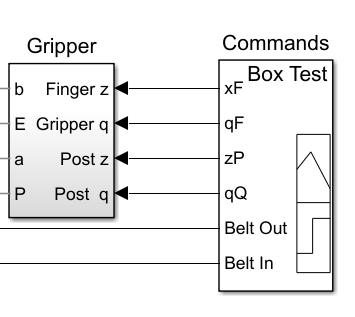
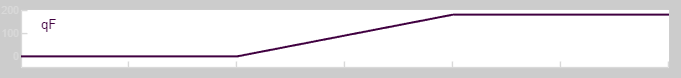
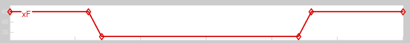
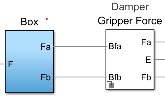
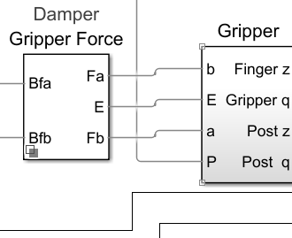
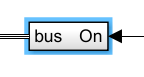
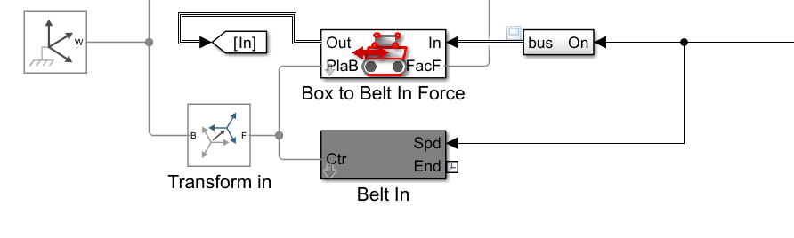

# Gripper_2Belts Solution Notes

## What I did
I completed the wiring and configuration of the pick-and-place model so that the simulation runs and performs the expected sequence:

1. Box moves on Belt In.
2. Gripper closes and grips the box.
3. Post and arm move the box to Belt Out.
4. Gripper opens and releases the box.
5. Box continues moving on Belt Out.

The final model file is:
- `Gripper_2Belts_solution.slx`

A simulation recording is included as:
- `screen_recording.mp4`

## How I figured out the missing connections
I used a structured comparison workflow:

1. Opened the top-level model and identified unconnected blocks and missing components.
2. Opened subsystem internals one by one (Gripper, Belt In, Belt Out, Commands, Box-related contact blocks).
3. Used Belt In as the reference template because it was already correctly connected.
4. Matched signal flow and frame-chain logic between Belt In and Belt Out.
5. Checked all physical frame chains from each mechanism back to World Frame.
6. Ran the model repeatedly after each major fix to isolate mistakes quickly.

## Key blocks I added at the top level
I added and configured the required missing blocks:

1. World Frame
- Purpose: Root inertial/ground reference for all multibody frame chains.

2. Transform Belt Out (Rigid Transform)
- Purpose: Places and orients the outgoing conveyor in the global scene.

3. Transform Belt In (Rigid Transform)
- Purpose: Places and orients the incoming conveyor in the global scene.

4. Goto block with tag `Out`
- Purpose: Routes the outgoing belt command signal without long wires.

5. Goto1 block with tag `In`
- Purpose: Routes the incoming belt command signal without long wires.

## What the important values represent
### 1) Transform Belt Out rotation
- Configured with 180 degrees about +Z.
- Meaning: The outgoing belt must face opposite to the incoming belt direction.
- Why this value: A half-turn around Z reverses belt travel orientation in the top view.

### 2) Transform Belt In rotation
- Configured with -90 degrees about +Z.
- Meaning: Aligns the incoming belt axis with the global coordinate layout used by the full assembly.
- Why this value: Quarter-turn clockwise about Z matches the intended entry direction.

### 3) Gain of -1 in Gripper
- Meaning: Finger B must move equal amount in opposite direction to Finger A.
- Why this value: Ensures symmetric open/close behavior around the centerline.

### 4) Belt speed chain (Gain + Integrator)
- Meaning: Converts command speed to roller angle over time.
- Why this value flow: Revolute joints need angular position/angle input evolution, so speed is integrated.

### 5) Contact force interface ports (PlaB and FacF)
- Meaning:
  - PlaB: Physical frame/location where contact acts.
  - FacF: Contact parameter input used by force model.
- Why important: Wrong port mapping causes no motion, unrealistic motion, or unstable contact.

## How I figured out the connections

I traced the model in small chains and validated each chain before moving to the next one.

1. Commands to Gripper mapping

-  first I checked that finger Z is responsible for the sliding of the the gripper arm .
- and Gripper q is for lifting purpose 

- Signal check for `qF`
  - I used the scope to verify `qF` ramps smoothly from low value to its target and then holds.
  - so i connect it with gripper Q

- Signal check for `xF`
  - I verified `xF` switches between two levels at the expected times.
  - i connect it with finger Z as it first grip the block and at the end it ungrip it .

- for Post z and Post q I didn't have any idea so I simply connect it with zP and qQ.

2. Box contact outputs to Damper Gripper Force
- Next, I connected the `Box` contact/frame outputs into the `Damper Gripper Force` block:
  - `Fa` -> `a`.............................................`Fb` -> `b`
  -                   OR 
  - `Fa` -> `b`..............................................`Fb` -> `a`

- we can connect it in both ways as it provides the contact/reference signals required for stable interaction with the gripper.

3. Damper Gripper Force outputs to Gripper inputs
- Then I connected `Damper Gripper Force` outputs to the `Gripper` ports:
  - `Fa` -> `b` input side
  - `E` -> `Gripper q`
  - `Fb` -> `a` input side
  - Remaining chain to `Post q` as required by the model wiring
- This completed the actuation/feedback path between force shaping and gripper motion.

4. Signal check for `qF`
- I used the scope to verify `qF` ramps smoothly from low value to its target and then holds.
- This confirmed the command profile was correct and not disconnected.

5. Rule of bus is simply specify the speed of the rolling belt

      

6. belt in connections 

      

- bus is connected to belt in of commands block
- In box to belt in block spd is not defined so we connect bus to spd of box to belt in block
- spd of belt in block is directly connected belt in signal of commands block
- FacF connected to  Init Box 6-DOF Joint ( provide 6 degree of freedom 3 transatonal and 3 rotaional )
- F of tranformation belt in connect with plac of box to belt in block and with ctr of belt in block 
it decides the orinetation and placent of belt 
- transform of belt in connect with World Frame ( placement of belt) and with B of Init Box 6-DOF Joint block.
- GOTO( In ) connects with out of box to belt in block (to measure the normal force )

7. similar connections are for belt out 

