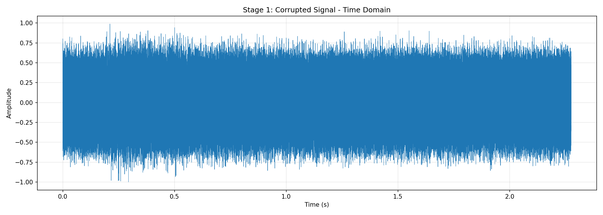
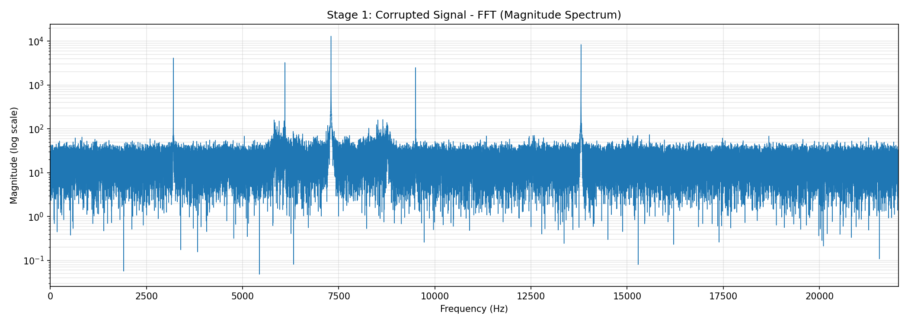
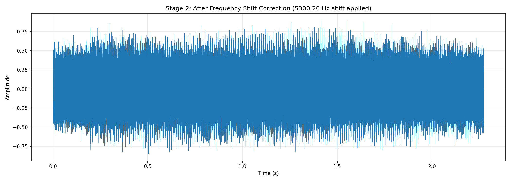
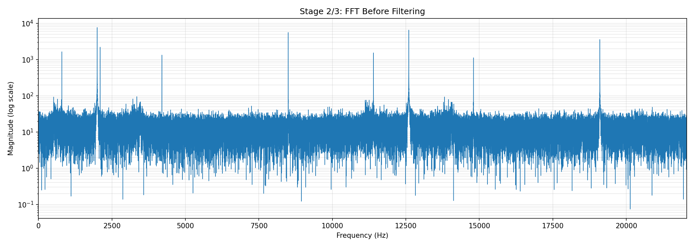
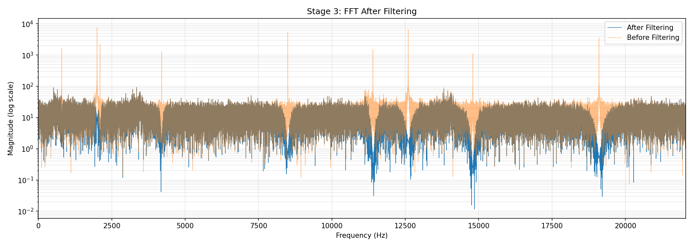
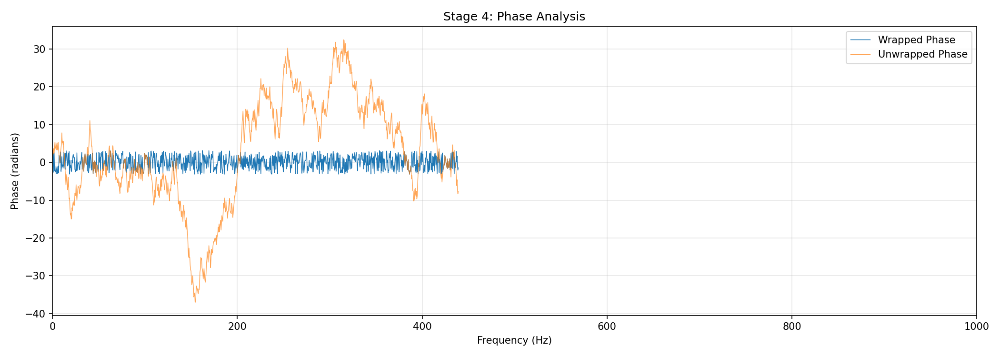
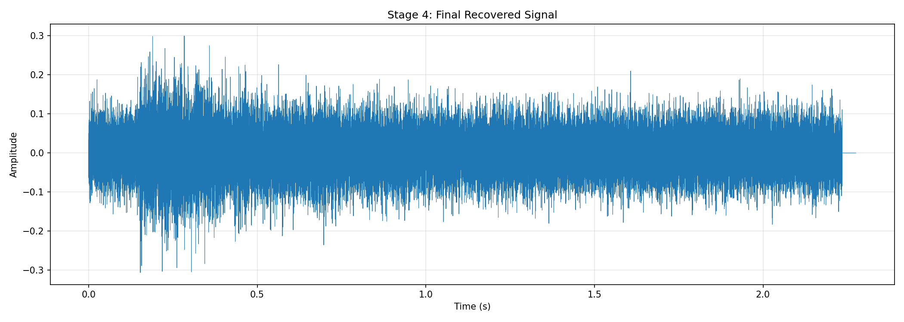

# Corrupted Audio Recovery 

## Overview
This project recovers a clean speech-like signal from `corrupted.wav` using FFT-based analysis and progressive correction in four stages:

1. Time/frequency inspection of the received signal
2. Frequency-shift correction
3. Removal of narrowband spectral spikes
4. Phase-delay analysis and correction

Final output audio: `recovered_sol.wav`

From a physics and signals perspective, the waveform is treated as a real-valued pressure-amplitude signal $x(t)$ sampled at rate $f_s$ (samples/s). Corruptions are modeled as operations in time and frequency domains:

- Frequency translation (heterodyning / mixing)
- Additive narrowband interference (tonal noise)
- Linear phase distortion (effective time delay)

The workflow uses Fourier analysis because time-domain distortions become structurally simpler in the spectral domain.

## Signal Model and Core Equations

For sampled audio $x[n] = x(nT_s)$ with $T_s = 1/f_s$:

$$
X[k] = \sum_{n=0}^{N-1} x[n] e^{-j 2\pi kn/N}
$$

$$
f_k = \frac{k}{N} f_s, \quad k = 0,1,\dots,N-1
$$

Magnitude and phase are:

$$
|X[k]|, \quad \phi[k] = \arg(X[k])
$$

Reconstruction is via inverse DFT:

$$
x[n] = \frac{1}{N}\sum_{k=0}^{N-1} X[k] e^{j 2\pi kn/N}
$$

Because speech is a band-limited physical signal, most intelligibility energy is concentrated at low frequencies (roughly below 4 kHz). Any strong displacement away from this region suggests modulation or spectral translation.

## Tools and Libraries Used
- Python 3
- NumPy
- SciPy (`scipy.io.wavfile`, `scipy.signal`)
- Matplotlib

## Stage 1: Inspect the Corrupted Signal
### What was observed
- The time-domain waveform confirms a valid audio-like signal.
- The FFT shows dominant energy distribution that suggests corruption/modification beyond normal speech placement.

### Physics interpretation
- In acoustics, microphone voltage is proportional to pressure variation; a natural speech waveform should have broadband but low-frequency-dominant structure.
- If spectral energy is unexpectedly centered at higher frequency, this indicates a carrier-like shift rather than natural vocal production.

### Plot: Time Domain (Corrupted)

### Plot: FFT (Corrupted)

## Stage 2: Detect and Undo Frequency Shift
### Reasoning
Normal speech energy is expected largely in low frequencies (roughly 0-4 kHz). The solution estimates dominant spectral behavior and applies a complex exponential correction when a high-frequency shift is detected.

### Technique Used
- Compute FFT magnitude.
- Find dominant peak frequency.
- If dominant energy is abnormally high, estimate a shift and demodulate:

`x_corrected(t) = Re{x_corrupted(t) * exp(-j*2*pi*f_shift*t)}`

### Physics/mathematics behind this step
Frequency translation follows the modulation theorem:

$$
x(t)e^{j2\pi f_0 t} \Longleftrightarrow X(f-f_0)
$$

So multiplying by $e^{-j2\pi f_0 t}$ shifts the spectrum back by $f_0$. In discrete time:

$$
x_{\text{shifted}}[n] = x[n] e^{-j2\pi f_0 n/f_s}
$$

The real part is retained because playable WAV audio is real-valued. Conceptually, this is coherent demodulation: remove the carrier/offset so baseband speech returns to its expected region.

### Plots

## Stage 3: Remove Narrow Spectral Spikes
### What was observed
After frequency realignment, narrow high-magnitude spectral lines remain that are not typical of natural speech.

### Technique Used
- Detect prominent peaks in the positive-frequency FFT.
- For each detected spike, design an IIR notch filter (`scipy.signal.iirnotch`).
- Apply zero-phase filtering (`scipy.signal.filtfilt`) to avoid additional phase distortion.

### Physics/mathematics behind this step
Narrow peaks correspond to near-sinusoidal interference terms:

$$
n_i(t) = A_i\cos(2\pi f_i t + \theta_i)
$$

A sinusoid appears as sharp spectral lines at $\pm f_i$, unlike the smoother envelope of speech formants. A notch filter suppresses energy in a thin band around each interference frequency.

For normalized digital radian frequency $\omega_0$, the notch transfer function form is:

$$
H(z)=\frac{1-2\cos(\omega_0)z^{-1}+z^{-2}}{1-2r\cos(\omega_0)z^{-1}+r^2 z^{-2}},\quad 0<r<1
$$

The quality factor $Q$ controls bandwidth: higher $Q$ gives a narrower notch (less damage to nearby speech content).

### Plot: FFT Before vs After Filtering

## Stage 4: Phase/Delay Correction
### What was observed
Even with cleaner magnitude spectrum, perceived audio quality can still be off due to phase-related delay.

### Technique Used
- Analyze FFT phase on positive frequencies.
- Unwrap phase and fit a line to estimate linear phase slope.
- Convert slope to delay: `delay = -slope/(2*pi)`.
- Compensate via sample shift (`np.roll`) and zero-fill wrapped regions.

### Physics/mathematics behind this step
A pure delay $\tau$ in time domain causes linear phase in frequency domain:

$$
x(t-\tau) \Longleftrightarrow X(f)e^{-j2\pi f\tau}
$$

Hence phase is approximately:

$$
\phi(f) \approx -2\pi f\tau + \phi_0
$$

If a fitted slope is $m = d\phi/df$, then:

$$
	au = -\frac{m}{2\pi}
$$

Discrete sample correction uses:

$$
N_\tau = \text{round}(\tau f_s)
$$

Then shift the signal by $N_\tau$ samples to compensate timing offset. This improves alignment of transients and perceived clarity even if magnitude spectrum already looks clean.

### Plots

## Final Output
- Recovered waveform written to: `recovered_sol.wav`
- Pipeline implemented in: `solution.py`
- Diagnostic plots stored in: `plots_sol_cmp3/`

## Conclusion
The corrupted signal appears to include a combination of:
- Frequency translation
- Narrowband tonal interference
- Residual linear phase delay

By progressively identifying these artifacts in the frequency domain and correcting each one, the recovered output is significantly cleaner and more speech-like.

In physical terms, the pipeline reverses three distinct channel impairments:
1. Spectral displacement (mixer-like shift)
2. Additive tonal contamination (external periodic interferers)
3. Propagation/system timing offset (group delay approximation)

This staged inverse-model approach is robust because each correction is validated by measurable spectral evidence rather than assumed a priori.
